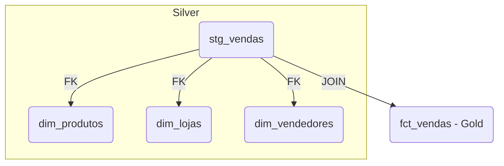

# Live Data Warehouse (PostgreSQL, dbt & Airflow)

Em parceria com a **3D Universe Creators** — sorteio de logos em impressão 3D de Power BI e Python

## 💡 Recomendado para Windows
Se estiver usando Windows, o melhor cenário é:

Usar o WSL2 (Subsistema Linux do Windows) com uma distro como Ubuntu.

Você roda tudo como se estivesse em um Linux real, incluindo Docker, dbt, Airflow, PostgreSQL e VS Code com integração total.

---

## Visão Geral

Este projeto demonstra a construção de um **Data Warehouse** completo utilizando **PostgreSQL** como banco relacional, **dbt** para transformação de dados e **Apache Airflow** para orquestração de pipelines. O objetivo é atender às necessidades de integração, tratamento, análise e visualização de dados para áreas de vendas, estoque e produção.

---

## Requisitos de Negócio

1. **Coleta e Integração de Dados**  
   - Integração automática com sistemas ERP para capturar tabelas de vendas, estoque e ordens de produção, com atualização diária ou em tempo real.  
   - Tratamento e padronização (nomes de produtos, datas, filiais, centros de custo).  
   - Armazenamento em estrutura analítica (Data Warehouse ou Lakehouse).

2. **Análises Essenciais**  
   - Resumo diário de vendas (quantidade, faturamento, ticket médio por loja, canal e produto).  
   - Ruptura e giro de estoque (estoque zerado, tempo médio de reposição, giro por categoria).  
   - Status da produção (ordens em aberto, em atraso, produção por linha/fábrica).  
   - Comparativo Real × Meta (metas comerciais por equipe, linha de produto e período).  
   - Alertas operacionais para desvios em vendas, estoque ou produção.

3. **Visualização e Ações**  
   - Dashboard unificado com painéis interativos para vendas, estoque e produção, acessível em desktop e mobile.  
   - Filtros dinâmicos por período, filial, produto, categoria e canal.  
   - Alertas automatizados (e-mail/WhatsApp) para eventos críticos.  
   - Exportação de relatórios (Excel/PDF) para reuniões estratégicas.

---

## Como Começar

### 1. Preparação do Projeto

```bash
# Clone o projeto e entre no diretório
git clone https://github.com/seu-usuario/seu-projeto.git
cd seu-projeto

# Crie um ambiente virtual
python -m venv .venv
source .venv/bin/activate

# Instale as dependências
pip install -r requirements.txt
```

### 2. Gerar uma chave para criptografia (opcional para dbt)

```bash
python -c "from cryptography.fernet import Fernet; print(Fernet.generate_key().decode())"
```

### 3. Crie as pastas necessárias

```bash
mkdir -p dags logs plugins dbt
```
#### 4. Gerar dados fake e subir dados para o postgres

# Scripts DDL – Camada **bronze**

> **Execute** estes comandos no PostgreSQL antes da ingestão.  
> Cada tabela recebe uma chave primária surrogate (`BIGSERIAL`) iniciando em 1.

---

## 1. Criar schema

```sql
CREATE SCHEMA IF NOT EXISTS bronze;
```

---

## 2. Tabela `bronze.vendas`

```sql
CREATE TABLE IF NOT EXISTS bronze.vendas (
    pk_vendas       BIGSERIAL PRIMARY KEY,
    id_venda        BIGINT        NOT NULL,
    id_produto      INTEGER       NOT NULL,
    preco           NUMERIC(12,2) NOT NULL,
    quantidade      INTEGER       NOT NULL,
    data_venda      DATE          NOT NULL,
    id_cliente      INTEGER,
    id_loja         INTEGER,
    id_vendedor     INTEGER,
    meio_pagamento  TEXT,
    parcelamento    SMALLINT
);

CREATE INDEX IF NOT EXISTS idx_vendas_id_venda ON bronze.vendas (id_venda);
CREATE INDEX IF NOT EXISTS idx_vendas_data     ON bronze.vendas (data_venda);
CREATE INDEX IF NOT EXISTS idx_vendas_produto  ON bronze.vendas (id_produto);
```

---

## 3. Tabela `bronze.devolucoes`

```sql
CREATE TABLE IF NOT EXISTS bronze.devolucoes (
    pk_devolucao    BIGSERIAL PRIMARY KEY,
    id_venda        BIGINT    NOT NULL,
    id_produto      INTEGER   NOT NULL,
    preco           NUMERIC(12,2) NOT NULL,
    quantidade      INTEGER   NOT NULL,
    data_venda      DATE      NOT NULL,
    data_devolucao  DATE      NOT NULL,
    id_cliente      INTEGER,
    id_loja         INTEGER,
    id_vendedor     INTEGER,
    motivo          TEXT,
    UNIQUE (id_venda, id_produto)
);

CREATE INDEX IF NOT EXISTS idx_dev_data_devolucao
    ON bronze.devolucoes (data_devolucao);
```

---

## 4. Tabela `bronze.produtos`

```sql
CREATE TABLE IF NOT EXISTS bronze.produtos (
    pk_produto          BIGSERIAL PRIMARY KEY,
    id_produto          INTEGER UNIQUE NOT NULL,
    nome_produto        TEXT    NOT NULL,
    categoria           TEXT,
    percentual_imposto  NUMERIC(5,2)
);
```

---

## 5. Tabela `bronze.lojas`

```sql
CREATE TABLE IF NOT EXISTS bronze.lojas (
    pk_loja     BIGSERIAL PRIMARY KEY,
    id_loja     INTEGER UNIQUE NOT NULL,
    nome_loja   TEXT    NOT NULL,
    logradouro  TEXT,
    numero      INTEGER,
    bairro      TEXT,
    cidade      TEXT,
    estado      CHAR(2),
    cep         VARCHAR(10)
);
```

---

## 6. Tabela `bronze.vendedores`

```sql
CREATE TABLE IF NOT EXISTS bronze.vendedores (
    pk_vendedor     BIGSERIAL PRIMARY KEY,
    id_vendedor     INTEGER UNIQUE NOT NULL,
    nome_vendedor   TEXT    NOT NULL,
    data_admissao   DATE,
    endereco_vendedor TEXT,
    data_nascimento DATE
);
```
---

## Orquestração com Apache Airflow (sem Docker)

### 1. Defina as variáveis de ambiente

```bash
export AIRFLOW_HOME=$(pwd)/airflow
AIRFLOW_VERSION=2.8.1
PYTHON_VERSION=$(python --version | cut -d " " -f2 | cut -d "." -f1,2)
CONSTRAINT_URL="https://raw.githubusercontent.com/apache/airflow/constraints-${AIRFLOW_VERSION}/constraints-${PYTHON_VERSION}.txt"
```

### 2. Instale o Airflow

```bash
pip install "apache-airflow==${AIRFLOW_VERSION}" --constraint "${CONSTRAINT_URL}"
```

### 3. Inicialize o Airflow e crie o usuário

```bash
airflow db init

airflow users create \
  --username admin \
  --firstname Admin \
  --lastname User \
  --role Admin \
  --email admin@example.com \
  --password admin
```

### 4. Inicie o Airflow

Em dois terminais diferentes:

**Terminal 1 – Scheduler**
```bash
source .venv/bin/activate
export AIRFLOW_HOME=$(pwd)/airflow
airflow scheduler
```

**Terminal 2 – Webserver**
```bash
source .venv/bin/activate
export AIRFLOW_HOME=$(pwd)/airflow
airflow webserver --port 8080
```

Acesse no navegador: [http://localhost:8080](http://localhost:8080)

---

## Execução Local de Geração de Dados (FastAPI)

### 1. Execute o gerador de dados com Uvicorn

```bash
uvicorn gerador_de_dados.api_vendas_batch:app --reload --port 8002
```

---

## Execução com Docker (opcional)

### 1. Login no GitHub Container Registry (GHCR)

```bash
echo <SEU_GITHUB_TOKEN> | docker login ghcr.io -u <SEU_USUARIO_GITHUB> --password-stdin
```

> Geração do token: GitHub > Settings > Developer Settings > Personal Access Tokens  
> Permissões necessárias: ✅ `read:packages`

### 2. Subir os containers (Airflow + dbt)

```bash
docker compose --env-file .env up
```

---

## Observações

- O projeto está pronto para rodar **Airflow localmente ou via Docker**.
- Recomendado: PostgreSQL como banco de metadados do Airflow em produção.
- O SQLite é usado aqui apenas para fins educacionais.

---

# 📁 Estrutura das Tabelas na Camada Bronze

As seguintes tabelas estão disponíveis no banco PostgreSQL, no schema `bronze`:

- `vendas`: informações de vendas realizadas.
- `devolucoes`: registros de devoluções de vendas.
- `produtos`: catálogo de produtos com categoria e impostos.
- `lojas`: dados cadastrais das lojas.
- `vendedores`: cadastro de vendedores e datas importantes.

---

## 🔧 Configuração do dbt (Data Build Tool)

Este projeto utiliza o **dbt** para organizar e transformar os dados da camada bronze até a gold. Abaixo estão os passos completos para configuração e execução:

### 1. Inicialização do Projeto

```bash
dbt init vendas_dw
```

Siga os prompts e selecione o adaptador `Postgres`.

---

### 2. Estrutura Esperada do Projeto

```text
vendas_dw/
├── dbt_project.yml
├── models/
│   ├── bronze/
│   │   ├── vendas.sql
│   │   ├── devolucoes.sql
│   │   ├── produtos.sql
│   │   ├── lojas.sql
│   │   └── vendedores.sql
│   ├── silver/
│   │   ├── fct_vendas.sql
│   │   ├── fct_devolucoes.sql
│   │   └── dim_lojas.sql
│   ├── gold/
│   │   ├── indicadores_vendas.sql
│   │   └── produtos_mais_devolvidos.sql
│   └── _sources.yml
```

---

### 3. Configuração do Profile

Crie ou edite o arquivo `~/.dbt/profiles.yml`:

```yaml
vendas_dw:
  target: dev
  outputs:
    dev:
      type: postgres
      host: localhost
      user: seu_usuario
      password: sua_senha
      port: 5432
      dbname: seu_banco
      schema: bronze
      threads: 4
```
bash (mover profile.yml)
```
mkdir -p ~/.dbt
code ~/.dbt/profiles.yml
```

---

### testar a conexão:
```
dbt debug --project-dir vendas_dw
```

### 4. Registro de Tabelas de Origem

`models/_sources.yml`:

```yaml
version: 2

sources:
  - name: bronze
    database: seu_banco
    schema: bronze
    tables:
      - name: vendas
      - name: devolucoes
      - name: produtos
      - name: lojas
      - name: vendedores
```

---

### 8. Executando o Projeto

Para compilar e rodar os modelos:

```bash
dbt run
```

Para validar a conexão e estrutura:

```bash
dbt debug
```

---

---

## 🗂️ Estrutura de diretórios

```
models/
├─ sources.yml               # definição das fontes bronze
├─ silver/
│  ├─ stg_vendas.sql
│  ├─ stg_devolucoes.sql
│  ├─ dim_produtos.sql
│  ├─ dim_lojas.sql
│  └─ dim_vendedores.sql
└─ gold/
   ├─ fct_vendas.sql
   ├─ fct_devolucoes.sql
   ├─ mart_receita_diaria_loja.sql
   └─ mart_receita_mensal_categoria.sql
```

> **Materialização**  
> - Todos os modelos usam `{{ config(materialized='table') }}`.  
> - Os *schemas* (**bronze**, **silver**, **gold**) são definidos no `project.yaml`.

---

## 1  🌱 Fonte única (`sources.yml`)

- **schema**: `bronze`
- **tabelas**: `vendas`, `devolucoes`, `produtos`, `lojas`, `vendedores`

Estas tabelas são carregadas dos CSV/XLSX originais e permanecem **imutáveis**.

---

## 2  🥈 Camada Silver — *Staging* e Dimensões

| Script | Descrição resumida | Entradas | Saída |
|--------|-------------------|----------|-------|
| **`stg_vendas.sql`** | Normaliza a tabela bruta de vendas. Faz *cast* de tipos, padroniza `meio_pagamento` e garante nomes consistentes. | `bronze.vendas` | `silver.stg_vendas` |
| **`stg_devolucoes.sql`** | Converte tipos e mantém coluna `motivo`. | `bronze.devolucoes` | `silver.stg_devolucoes` |
| **`dim_produtos.sql`** | Dimensão Produto (id, nome, categoria, % imposto). | `bronze.produtos` | `silver.dim_produtos` |
| **`dim_lojas.sql`** | Dimensão Loja (endereços normalizados). | `bronze.lojas` | `silver.dim_lojas` |
| **`dim_vendedores.sql`** | Dimensão Vendedor (datas convertidas). | `bronze.vendedores` | `silver.dim_vendedores` |

### 2.1  `stg_vendas.sql` — detalhes  
| Coluna final | Tipo | Transformação |
|--------------|------|---------------|
| `id_venda` | `BIGINT` | `cast(id_venda as bigint)` |
| `id_produto` | `INT` | — |
| `preco` | `NUMERIC(12,2)` | — |
| `quantidade` | `INT` | — |
| `data_venda` | `DATE` | — |
| `id_cliente` | `INT` | — |
| `id_loja` | `INT` | — |
| `id_vendedor` | `INT` | — |
| `meio_pagamento` | `TEXT` | `lower(trim(meio_pagamento))` |
| `parcelamento` | `SMALLINT` | — |

*(scripts das dimensões seguem padrão semelhante de `CAST`, renomeação e limpeza de texto)*

---

## 3  🥇 Camada Gold — Fatos & Marts

| Script | Propósito | Métricas/Transformações | Relacionamentos |
|--------|-----------|-------------------------|-----------------|
| **`fct_vendas.sql`** | Fato granular de vendas. | `receita_bruta = quantidade * preco` + join com dimensões. | `id_produto`, `id_loja`, `id_vendedor` |
| **`fct_devolucoes.sql`** | Fato de devoluções. | `valor_devolvido = quantidade * preco`. Mantém `motivo`. | usa dimensões via IDs (opcional) |
| **`mart_receita_diaria_loja.sql`** | Mart operacional: receita diária por loja. | `sum(receita_bruta)`, `count(distinct id_venda)`, `sum(quantidade)`. | deriva de `fct_vendas` |
| **`mart_receita_mensal_categoria.sql`** | Mart tático: receita mensal × categoria. | `date_trunc('month', data_venda)` → `mes`; `sum(receita_bruta)`. | deriva de `fct_vendas` |

### 3.1  `fct_vendas.sql` — fluxo simplificado


### 3.2  `mart_receita_diaria_loja.sql`
```sql
select
    data_venda,
    id_loja,
    nome_loja,
    sum(receita_bruta) as receita_diaria,
    count(distinct id_venda) as qtd_vendas,
    sum(quantidade) as itens_vendidos
from {{ ref('fct_vendas') }}
group by data_venda, id_loja, nome_loja;
```
> **Uso**: Painéis operacionais (metas diárias, comparativo de lojas).

---

## 4  🚀 Execução sugerida para a aula

```bash
# 1) Materializar staging
dbt run --select silver

# 2) Materializar fatos e marts
dbt run --select gold

# 3) Explorar lineage
dbt docs generate
dbt docs serve
```

### Tópicos para demonstrar
1. **Cast de tipos** e por que isso deve ficar fora do BI.  
2. **Separação de responsabilidade** (bronze imutável, silver conforma, gold agrega).  
3. **Lineage** no dbt Docs: como rastrear colunas.  
4. **Incremental vs. table**: quando trocar materialização.  
5. **Tests**: `unique`/`not_null` em IDs das dimensões e fatos.

---

## 5  📌 Resumo rápido

| Camada | Objetivo | Exemplos |
|--------|----------|----------|
| **Bronze** | Raw, somente ingestão. | CSV/XLSX originais. |
| **Silver** | Limpeza, tipagem, PK/FK, conformidade. | `stg_vendas`, `dim_*`. |
| **Gold** | Consumíveis por BI, agregações, modelos de negócio. | `fct_*`, `mart_*`. |

------------------------------------------------------------------------------------------

## 🧠 Autor

**Walter Gonzaga**  
Data Architect | Engenheiro de Dados | Mentor  
[LinkedIn](https://www.linkedin.com/in/waltergonzaga)

---