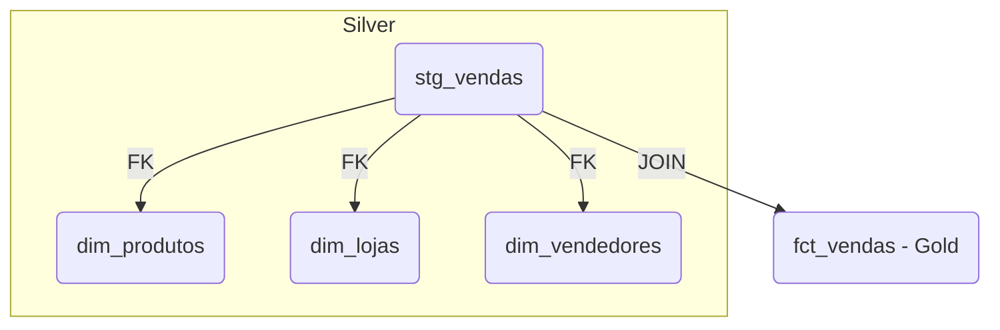

# Live Data Warehouse (PostgreSQL, dbt & Airflow)

Em parceria com a **3D Universe Creators** — sorteio de logos em impressão 3D de Power BI e Python

## 💡 Recomendado para Windows
Se estiver usando Windows, o melhor cenário é:

Usar o WSL2 (Subsistema Linux do Windows) com uma distro como Ubuntu.

Você roda tudo como se estivesse em um Linux real, incluindo Docker, dbt, Airflow, PostgreSQL e VS Code com integração total.

---

## Visão Geral

Este projeto demonstra a construção de um **Data Warehouse** completo utilizando **PostgreSQL** como banco relacional, **dbt** para transformação de dados e **Apache Airflow** para orquestração de pipelines. O objetivo é atender às necessidades de integração, tratamento, análise e visualização de dados para áreas de vendas, estoque e produção.

---

## Requisitos de Negócio

1. **Coleta e Integração de Dados**  
   - Integração automática com sistemas ERP para capturar tabelas de vendas, estoque e ordens de produção, com atualização diária ou em tempo real.  
   - Tratamento e padronização (nomes de produtos, datas, filiais, centros de custo).  
   - Armazenamento em estrutura analítica (Data Warehouse ou Lakehouse).

2. **Análises Essenciais**  
   - Resumo diário de vendas (quantidade, faturamento, ticket médio por loja, canal e produto).  
   - Ruptura e giro de estoque (estoque zerado, tempo médio de reposição, giro por categoria).  
   - Status da produção (ordens em aberto, em atraso, produção por linha/fábrica).  
   - Comparativo Real × Meta (metas comerciais por equipe, linha de produto e período).  
   - Alertas operacionais para desvios em vendas, estoque ou produção.

3. **Visualização e Ações**  
   - Dashboard unificado com painéis interativos para vendas, estoque e produção, acessível em desktop e mobile.  
   - Filtros dinâmicos por período, filial, produto, categoria e canal.  
   - Alertas automatizados (e-mail/WhatsApp) para eventos críticos.  
   - Exportação de relatórios (Excel/PDF) para reuniões estratégicas.

---

## Como Começar

### 1. Preparação do Projeto

```bash

# Crie um ambiente virtual
python3.11 -m venv .venv
source .venv/bin/activate

pip install --upgrade pip
pip install -r requirements.txt

```

### 2. Gerar uma chave para criptografia (opcional para dbt)

```bash
python -c "from cryptography.fernet import Fernet; print(Fernet.generate_key().decode())"
```

### 3. Crie as pastas necessárias

```bash
mkdir -p  logs plugins dbt
```
#### 4. Gerar dados fake e subir dados para o postgres

# Scripts DDL – Camada **bronze**

> **Execute** estes comandos no PostgreSQL antes da ingestão.  
> Cada tabela recebe uma chave primária surrogate (`BIGSERIAL`) iniciando em 1.

---

## 1. Criar schema

```sql
CREATE SCHEMA IF NOT EXISTS bronze;
```

---

## 2. Tabela `bronze.vendas`

```sql
CREATE TABLE IF NOT EXISTS bronze.vendas (
    pk_vendas       BIGSERIAL PRIMARY KEY,
    id_venda        BIGINT        NOT NULL,
    id_produto      INTEGER       NOT NULL,
    preco           NUMERIC(12,2) NOT NULL,
    quantidade      INTEGER       NOT NULL,
    data_venda      DATE          NOT NULL,
    id_cliente      INTEGER,
    id_loja         INTEGER,
    id_vendedor     INTEGER,
    meio_pagamento  TEXT,
    parcelamento    SMALLINT
);

CREATE INDEX IF NOT EXISTS idx_vendas_id_venda ON bronze.vendas (id_venda);
CREATE INDEX IF NOT EXISTS idx_vendas_data     ON bronze.vendas (data_venda);
CREATE INDEX IF NOT EXISTS idx_vendas_produto  ON bronze.vendas (id_produto);
```

---

## 3. Tabela `bronze.devolucoes`

```sql
CREATE TABLE IF NOT EXISTS bronze.devolucoes (
    pk_devolucao    BIGSERIAL PRIMARY KEY,
    id_venda        BIGINT    NOT NULL,
    id_produto      INTEGER   NOT NULL,
    preco           NUMERIC(12,2) NOT NULL,
    quantidade      INTEGER   NOT NULL,
    data_venda      DATE      NOT NULL,
    data_devolucao  DATE      NOT NULL,
    id_cliente      INTEGER,
    id_loja         INTEGER,
    id_vendedor     INTEGER,
    motivo          TEXT,
    UNIQUE (id_venda, id_produto)
);

CREATE INDEX IF NOT EXISTS idx_dev_data_devolucao
    ON bronze.devolucoes (data_devolucao);
```

---

## 4. Tabela `bronze.produtos`

```sql
CREATE TABLE IF NOT EXISTS bronze.produtos (
    pk_produto          BIGSERIAL PRIMARY KEY,
    id_produto          INTEGER UNIQUE NOT NULL,
    nome_produto        TEXT    NOT NULL,
    categoria           TEXT,
    percentual_imposto  NUMERIC(5,2)
);
```

---

## 5. Tabela `bronze.lojas`

```sql
CREATE TABLE IF NOT EXISTS bronze.lojas (
    pk_loja     BIGSERIAL PRIMARY KEY,
    id_loja     INTEGER UNIQUE NOT NULL,
    nome_loja   TEXT    NOT NULL,
    logradouro  TEXT,
    numero      INTEGER,
    bairro      TEXT,
    cidade      TEXT,
    estado      CHAR(2),
    cep         VARCHAR(10)
);
```

---

## 6. Tabela `bronze.vendedores`

```sql
CREATE TABLE IF NOT EXISTS bronze.vendedores (
    pk_vendedor     BIGSERIAL PRIMARY KEY,
    id_vendedor     INTEGER UNIQUE NOT NULL,
    nome_vendedor   TEXT    NOT NULL,
    data_admissao   DATE,
    endereco_vendedor TEXT,
    data_nascimento DATE
);
```
---

# 📁 Estrutura das Tabelas na Camada Bronze

As seguintes tabelas estão disponíveis no banco PostgreSQL, no schema `bronze`:

- `vendas`: informações de vendas realizadas.
- `devolucoes`: registros de devoluções de vendas.
- `produtos`: catálogo de produtos com categoria e impostos.
- `lojas`: dados cadastrais das lojas.
- `vendedores`: cadastro de vendedores e datas importantes.

---

## 🔧 Configuração do dbt (Data Build Tool)

Este projeto utiliza o **dbt** para organizar e transformar os dados da camada bronze até a gold. Abaixo estão os passos completos para configuração e execução:

### 1. Inicialização do Projeto

```bash
dbt init vendas_dw
```

Siga os prompts e selecione o adaptador `Postgres`.

---

### 2. Estrutura Esperada do Projeto

```text
vendas_dw/
├── dbt_project.yml
├── models/
│   ├── bronze/
│   │   ├── vendas.sql
│   │   ├── devolucoes.sql
│   │   ├── produtos.sql
│   │   ├── lojas.sql
│   │   └── vendedores.sql
│   ├── silver/
│   │   ├── fct_vendas.sql
│   │   ├── fct_devolucoes.sql
│   │   └── dim_lojas.sql
│   ├── gold/
│   │   ├── indicadores_vendas.sql
│   │   └── produtos_mais_devolvidos.sql
│   └── _sources.yml
```

---

### 3. Configuração do Profile

Crie ou edite o arquivo `~/.dbt/profiles.yml`:

```yaml
vendas_dw:
  target: dev
  outputs:
    dev:
      type: postgres
      host: localhost
      user: seu_usuario
      password: sua_senha
      port: 5432
      dbname: seu_banco
      schema: bronze
      threads: 4
```
bash (mover profile.yml)
```
mkdir -p ~/.dbt
code ~/.dbt/profiles.yml
```

---

### testar a conexão:
```
dbt debug --project-dir vendas_dw
```

### 4. Registro de Tabelas de Origem

`models/_sources.yml`:

```yaml
version: 2

sources:
  - name: bronze
    database: seu_banco
    schema: bronze
    tables:
      - name: vendas
      - name: devolucoes
      - name: produtos
      - name: lojas
      - name: vendedores
```
---

## 🗂️ Estrutura de diretórios

```
models/
├─ sources.yml               # definição das fontes bronze
├─ silver/
│  ├─ stg_vendas.sql
│  ├─ stg_devolucoes.sql
│  ├─ dim_produtos.sql
│  ├─ dim_lojas.sql
│  └─ dim_vendedores.sql
└─ gold/
   ├─ fct_vendas.sql
   ├─ fct_devolucoes.sql
   ├─ mart_receita_diaria_loja.sql
   └─ mart_receita_mensal_categoria.sql
```

> **Materialização**  
> - Todos os modelos usam `{{ config(materialized='table') }}`.  
> - Os *schemas* (**bronze**, **silver**, **gold**) são definidos no `project.yaml`.

---

## 4  🚀 Execução sugerida para a aula

```bash
# 1) Materializar staging
dbt run --select silver

# 2) Materializar fatos e marts
dbt run --select gold

# 3) Explorar lineage
dbt docs generate
dbt docs serve --port 8085

```

------------------------------------------------------------------------------------------

### Rodar no postgres:

## 🔹 Queries por Categoria

### 📂 Transformações de Dimensões

#### 🧾 dim_lojas.sql

```sql
-- {{ config(materialized = 'table') -- }}

with src as (

    select
        cast(id_loja  as int)   as id_loja,
        nome_loja,
        logradouro,
        cast("numero" as int)   as numero,
        bairro,
        cidade,
        estado,
        cep
    from -- {{ source('bronze','lojas') -- }}

)

select *
from src
```

#### 🧾 dim_produtos.sql

```sql
-- {{ config(materialized = 'table') -- }}

with src as (

    select
        cast(id_produto         as int)           as id_produto,
        nome_produto,
        categoria,
        cast(percentual_imposto as numeric(5,2))  as percentual_imposto
    from -- {{ source('bronze','produtos') -- }}

)

select *
from src
```

#### 🧾 dim_vendedores.sql

```sql
-- {{ config(materialized = 'table') -- }}

with src as (

    select
        cast(id_vendedor                as int)   as id_vendedor,
        nome_vendedor,
        cast(data_admissao     as date)  as data_admissao,
        endereco_vendedor,
        cast(data_nascimento   as date)  as data_nascimento
    from -- {{ source('bronze','vendedores') -- }}

)

select *
from src
```

### 📂 Preparação### 3.1  
`fct_vendas.sql` — fluxo simplificado


### 3.2  `mart_receita_diaria_loja.sql`
```sql
select
    data_venda,
    id_loja,
    nome_loja,
    sum(receita_bruta) as receita_diaria,
    count(distinct id_venda) as qtd_vendas,
    sum(quantidade) as itens_vendidos
from {{ ref('fct_vendas') }}
group by data_venda, id_loja, nome_loja;
```
> **Uso**: Painéis operacionais (metas diárias, comparativo de lojas).
 e Limpeza da Staging

#### 🧾 stg_vendas.sql

```sql
-- {{ config(
    materialized = 'incremental',
    unique_key = 'id_venda'
) -- }}

WITH src AS (

    SELECT
        CAST(id_venda       AS BIGINT)        AS id_venda,
        CAST(id_produto     AS INTEGER)       AS id_produto,
        CAST(preco          AS NUMERIC(12,2)) AS preco,
        CAST(quantidade     AS INTEGER)       AS quantidade,
        CAST(data_venda     AS DATE)          AS data_venda,
        CAST(id_cliente     AS INTEGER)       AS id_cliente,
        CAST(id_loja        AS INTEGER)       AS id_loja,
        CAST(id_vendedor    AS INTEGER)       AS id_vendedor,
        LOWER(TRIM(meio_pagamento))           AS meio_pagamento,
        CAST(parc### 3.1  `fct_vendas.sql` — fluxo simplificado


### 3.2  `mart_receita_diaria_loja.sql`
```sql
select
    data_venda,
    id_loja,
    nome_loja,
    sum(receita_bruta) as receita_diaria,
    count(distinct id_venda) as qtd_vendas,
    sum(quantidade) as itens_vendidos
from {{ ref('fct_vendas') }}
group by data_venda, id_loja, nome_loja;
```
> **Uso**: Painéis operacionais (metas diárias, comparativo de lojas).
elamento   AS SMALLINT)      AS parcelamento
    FROM -- {{ source('bronze', 'vendas') -- }}

    
      WHERE id_venda NOT IN (
        SELECT id_venda FROM -- {{ this -- }}
      )
    

)

SELECT *
FROM src
```

#### 🧾 stg_devolucoes.sql

```sql
-- {{ config(materialized = 'table') -- }}

with src as (

    select
        cast(id_venda       as bigint)              as id_venda,
        cast(id_produto     as int)                 as id_produto,
        cast(preco          as numeric(12,2))       as preco,
        cast(quantidade     as int)                 as quantidade,
        cast(data_venda     as date)                as data_venda,
        cast(data_devolucao as date)                as data_devolucao,
        cast(id_cliente     as int)                 as id_cliente,
        cast(id_loja        as int)                 as id_loja,
        cast(id_vendedor    as int)                 as id_vendedor,
        motivo
    from -- {{ source('bronze','devolucoes') -- }}

)

select *
from src
```

### 📂 Construção das Tabelas Fato

#### 🧾 fct_vendas.sql

```sql
-- {{ config(
    materialized = 'view'
) -- }}

WITH ventes AS (
    SELECT * FROM -- {{ ref('stg_vendas') -- }}
),

dim_produtos   AS (SELECT * FROM -- {{ ref('dim_produtos')   -- }}),
dim_lojas      AS (SELECT * FROM -- {{ ref('dim_lojas')      -- }}),
dim_vendedores AS (SELECT * FROM -- {{ ref('dim_vendedores') -- }})

SELECT
    v.id_venda,
    v.id_produto,
    v.id_loja,
    v.id_vendedor,
    v.id_cliente,
    v.data_venda,
    v.quantidade,
    v.preco,
    v.quantidade * v.preco AS receita_bruta,
    v.meio_pagamento,
    v.parcelamento,

    -- dimensões
    p.nome_produto,
    p.categoria,
    l.nome_loja,
    l.cidade,
    ve.nome_vendedor
FROM ventes v
LEFT JOIN dim_produtos   p  ON v.id_produto  = p.id_produto
LEFT JOIN dim_lojas      l  ON v.id_loja     = l.id_loja
LEFT JOIN dim_vendedores ve ON v.id_vendedor = ve.id_vendedor
```

#### 🧾 fct_devolucoes.sql

```sql
-- {{ config(materialized = 'view') -- }}

with devol as (
    select * from -- {{ ref('stg_devolucoes') -- }}
)

select
    id_venda,
    id_produto,
    id_loja,
    id_vendedor,
    id_cliente,
    data_venda,
    data_devolucao,
    quantidade,
    preco,
    quantidade * preco                             as valor_devolvido,
    motivo
from devol
```

### 📂 Indicadores e Mart de Vendas

#### 🧾 indicadores_vendas.sql

```sql
-- {{ 
  config(
    materialized = 'view',
    schema       = 'silver'
  ) 
-- }}

WITH base AS (
    SELECT
        data_venda,
        id_loja,
        preco,
        quantidade,
        id_venda
    FROM -- {{ ref('fct_vendas') -- }}
)
SELECT
    data_venda,
    id_loja,
    SUM(preco * quantidade) AS receita_total,
    COUNT(DISTINCT id_venda) AS qtd_vendas
FROM base
GROUP BY data_venda, id_loja
```

#### 🧾 mart_receita_diaria_loja.sql

```sql
-- {{ config(materialized = 'view') -- }}

with fct as (
    select * from -- {{ ref('fct_vendas') -- }}
)

select
    data_venda,
    id_loja,
    nome_loja,
    sum(receita_bruta)                           as receita_diaria,
    count(distinct id_venda)                     as qtd_vendas,
    sum(quantidade)                              as itens_vendidos
from fct
group by data_venda, id_loja, nome_loja
```

#### 🧾 mart_receita_mensal_categoria.sql

```sql
-- {{ config(materialized = 'view') -- }}

with fct as (
    select * from -- {{ ref('fct_vendas') -- }}
),

base as (
    select
        date_trunc('month', data_venda)::date    as mes,
        categoria,
        sum(receita_bruta)                       as receita_mensal,
        sum(quantidade)                          as itens_vendidos
    from fct
    group by 1, 2
)

select * from base
```

### 📂 Análises Avançadas - Camada Gold

#### 🧾 gold_media_movel_7d.sql

```sql
-- {{ config(materialized = 'view') -- }}

WITH receita_diaria AS (
    SELECT
        data_venda,
        id_loja,
        nome_loja,
        SUM(receita_bruta) AS receita_diaria
    FROM -- {{ ref('fct_vendas') -- }}
    GROUP BY data_venda, id_loja, nome_loja
)

SELECT
    *,
    AVG(receita_diaria) OVER (
        PARTITION BY id_loja
        ORDER BY data_venda
        ROWS BETWEEN 6 PRECEDING AND CURRENT ROW
    ) AS media_movel_7d
FROM receita_diaria
```

#### 🧾 gold_crescimento_receita_categoria.sql

```sql
-- {{ config(materialized = 'view') -- }}

WITH base AS (
    SELECT
        DATE_TRUNC('month', data_venda)::date AS mes,
        categoria,
        SUM(receita_bruta) AS receita_mensal
    FROM -- {{ ref('fct_vendas') -- }}
    GROUP BY 1, 2
),

crescimento AS (
    SELECT
        mes,
        categoria,
        receita_mensal,
        LAG(receita_mensal) OVER (PARTITION BY categoria ORDER BY mes) AS receita_mes_anterior
    FROM base
)

SELECT
    *,
    ROUND(
        CASE
            WHEN receita_mes_anterior > 0 THEN 
                (receita_mensal - receita_mes_anterior) / receita_mes_anterior::numeric
            ELSE NULL
        END, 4
    ) AS crescimento_pct
FROM crescimento
```

#### 🧾 gold_ticket_medio_categoria.sql

```sql
-- {{ config(materialized = 'view') -- }}

WITH base AS (
    SELECT
        DATE_TRUNC('month', data_venda)::date AS mes,
        categoria,
        SUM(receita_bruta) AS receita,
        SUM(quantidade) AS itens
    FROM -- {{ ref('fct_vendas') -- }}
    GROUP BY 1, 2
)

SELECT
    mes,
    categoria,
    receita,
    itens,
    ROUND(receita / NULLIF(itens, 0), 2) AS ticket_medio
FROM base
```

#### 🧾 gold_taxa_devolucao.sql

```sql
-- {{ config(materialized = 'view') -- }}

WITH vendas AS (
    SELECT id_venda, id_produto, data_venda, receita_bruta
    FROM -- {{ ref('fct_vendas') -- }}
),
devolucoes AS (
    SELECT id_venda, data_devolucao
    FROM -- {{ ref('fct_devolucoes') -- }}
)

SELECT
    v.data_venda,
    COUNT(DISTINCT v.id_venda) AS vendas_totais,
    COUNT(DISTINCT d.id_venda) AS vendas_devolvidas,
    ROUND(
        COUNT(DISTINCT d.id_venda)::numeric / NULLIF(COUNT(DISTINCT v.id_venda), 0),
        4
    ) AS taxa_devolucao
FROM vendas v
LEFT JOIN devolucoes d ON v.id_venda = d.id_venda
GROUP BY v.data_venda
```

#### 🧾 gold_receita_acumulada_loja.sql

```sql
-- {{ config(materialized = 'view') -- }}

WITH base AS (
    SELECT
        data_venda,
        id_loja,
        nome_loja,
        EXTRACT(YEAR FROM data_venda) AS ano,
        receita_bruta
    FROM -- {{ ref('fct_vendas') -- }}
),

acumulado AS (
    SELECT
        data_venda,
        id_loja,
        nome_loja,
        ano,
        SUM(receita_bruta) OVER (
            PARTITION BY id_loja, ano ORDER BY data_venda
        ) AS receita_acumulada
    FROM base
)

SELECT * FROM acumulado
```